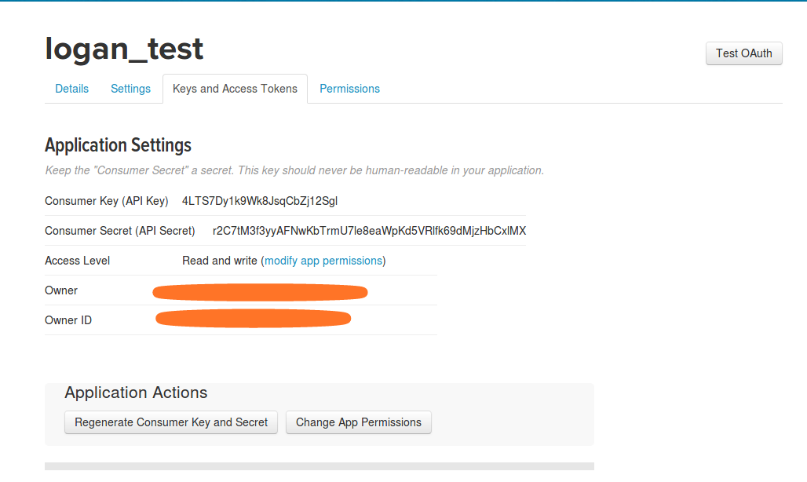
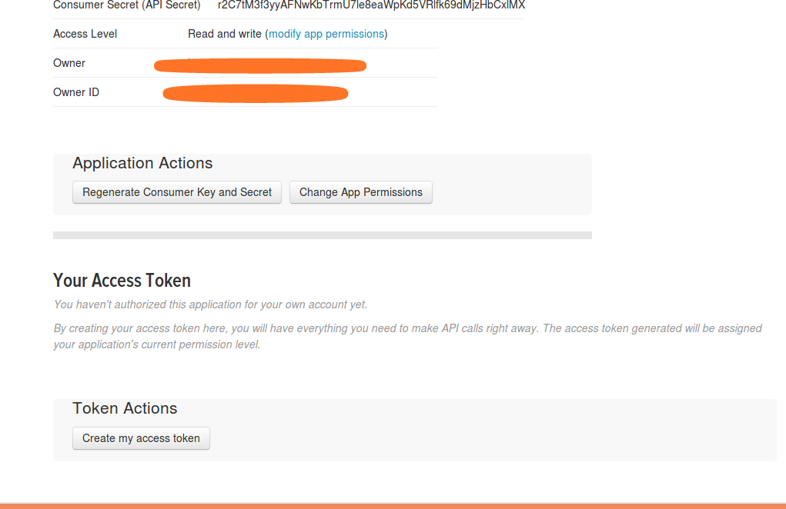
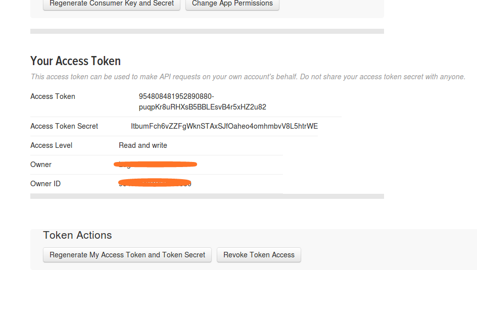

# How to generate Access token from twitter
Follow these simple steps
I suppose that you have a twitter account, if you do not have twitter account then create a new account.

### 1. Open http://apps.twitter.com
After opening apps.twitter click on **Create New App**


### 2. Fill some information in this form and submit
***You can put some random URL into website***


### 3. Now click on ```Keys and Access Tokens```


### 4. In application section find the following 
**Consumer key**   *************************
**Consumer Secret(API Key)**  ************************


### 5. After getting information scroll down and click on **Create My access token*** in ````Your access token section````


### 6. Finall you will be able to get ```Access Token``` and ```Access Token Secreat``` 


## Now you have the following information 

1. consumer_key = '********'
2. consumer_secret = '***********'

3. access_token = '************'
4. access_token_secret = '**********'

Fill your real information into the python script and run...


  
 

